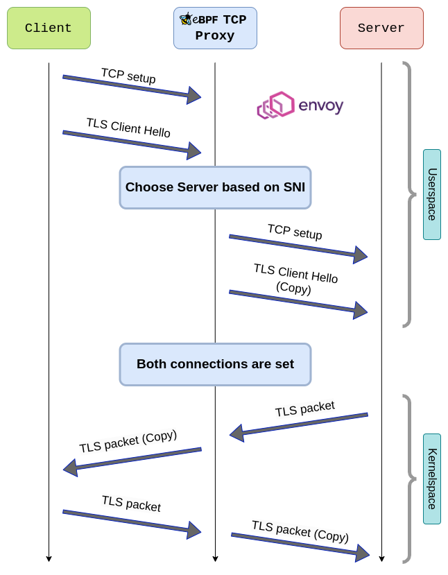

# eBPF TCP Proxy - Envoy Filters

This envoy filters extend the [TCP Proxy](https://www.envoyproxy.io/docs/envoy/latest/configuration/listeners/network_filters/tcp_proxy_filter.html#tcp-proxy) filter using eBPF:

* The EbpfTcpProxyXDP filter uses a XDP and a TC program, working at the lowest possible packet resolution: this filter intercepts every packet and redirects them by manipulating its bytes, before any type of TCP processing
* The EbpfTcpProxySKB filter uses a SOCKOPS and a SK_SKB program, working at the TCP level: it redirects each socket to its corresponding one

This repo is based on the [Envoy filter example](https://github.com/envoyproxy/envoy-filter-example)

This was tested with [Envoy v1.32.0](https://github.com/envoyproxy/envoy/releases/tag/v1.32.0)

## How it works

### This code is part of my master thesis called [Accelerating L4 Middleboxes in the Linux kernel](https://www.politesi.polimi.it)

This program is meant as a drop-in replacement to the TCP Proxy Envoy filter; it should be run on a Middlebox that relays all TCP packets, encrypted with TLS, from one Client machine to a Server one and viceversa.

The eBPF programs inject themselves in the kernel, stopping packets to traverse higher up the kernel networking stack and instead they handle them immediately. This way, packets can be read, transformed and sent out without ever needing to go to userspace.

There are two different implementations, one working at the XDP level (working with raw TCP packets) and one at the SK\_SKB level (working at the stream/socket level). Their behaviour is basically the same:



At the XDP level, raw packet headers have their own fields changed and sent back; the whole socket abstraction is skipped, while still mantaining TCP semantics.

To know more details, read my thesis on [politesi](https://www.politesi.polimi.it)

## Dependencies

+ Linux kernel >= 6.1
+ libbpf >= 1.1
+ bpftool >= 7.1
+ clang >= 14

## Building

To setup bazel, follow [the envoy guide](https://github.com/envoyproxy/envoy/tree/main/bazel/README.md)

To build the Envoy static binary:

1. `git submodule update --init`
2. `ln -s ebpf_tcp_proxy_skb/ebpf_tcp_proxy_skb.proto envoy/api/envoy/extensions/filters/network/tcp_proxy/v3/ && ln -s ebpf_tcp_proxy_xdp/ebpf_tcp_proxy_xdp.proto envoy/api/envoy/extensions/filters/network/tcp_proxy/v3/`
3. `bazel build --linkopt="-lbpf" //:envoy`

Note that on the first time this may take a while because [it has to compile all of envoy](https://www.envoyproxy.io/docs/envoy/latest/faq/build/speed)

TODO: remove step 2

## Running

Once it has compiled, run on a Middleware server Envoy using the configuration file that uses this filter:

`sudo ./bazel-bin/envoy --config-path ./conf/ebpf_tcp_proxy_config_xdp.yaml`

or

`sudo ./bazel-bin/envoy --config-path ./conf/ebpf_tcp_proxy_config_skb.yaml`

### Configuration

Since this filters are an extension of TCP Proxy, they take their own configuration parameters plus a whole configuration of TCP Proxy:

Ex. for EbpfTcpProxyXDP

```yaml
filters:
- name: ebpf_tcp_proxy_xdp
  typed_config:
    "@type": type.googleapis.com/envoy.extensions.filters.network.tcp_proxy.v3.EbpfTcpProxyXDP
    interface_index: 5 # the interface index to attach the eBPF programs to
    tcp_proxy:
      # configuration of TCP proxy
      ...
```

In the "conf" directory there are three example configuration files: they all use 3 envoy clusters (kafka1_cluster, kafka2_cluster, kafka3_cluster) and choose between these using the SNI "kafkax.server.test"

These three configuration files can be used to test the EBPF Tcp Proxy filters against the vanilla Tcp Proxy one, just use the "envoy_config.yaml" instead of the "ebpf_tcp_proxy_config_xxx.yaml"

## Benchmarking and testing

### Stress testing

NOTE: since we assume SSL, we use [iperf-ssl](https://github.com/TrekkieCoder/iperf-ssl) instead of standard iperf

On the server, run `iperf --tls=v1.2 -s -p <server-port>`

On the client, run `iperf --tls=v1.2 -c <middleware-ip> -p <middleware-port> -A kafkax.server.test`

### HTTP benchmarking

Most of the performace benefit where seen while requesting big (>10MB) files

Setup a HTTP server (usually [nginx](https://nginx.org/)) and use the "/etc/hosts" to associate the kafkax.server.test to the Middleware

* [autocannon](https://github.com/mcollina/autocannon)

On the client, run `autocannon https://kafkax.server.test:<middleware-port>`

* [wrk](https://github.com/wg/wrk)

On the client, run `wrk https://kafkax.server.test:<middleware-port>`

* [bombardier](https://github.com/codesenberg/bombardier)

On the client, run `bombardier http://kafkax.server.test:<middleware-port>`
